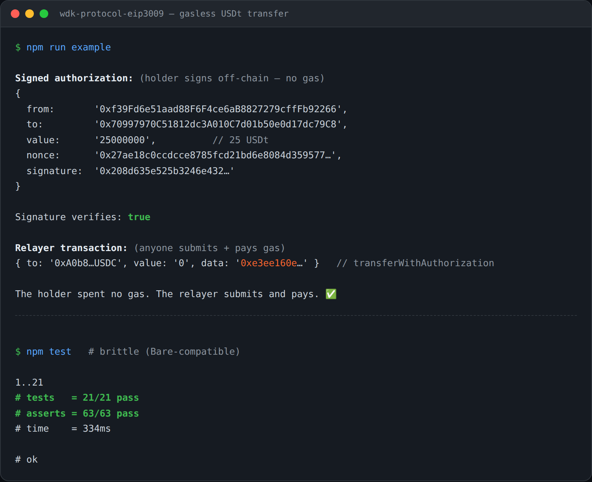

<div align="center">

# wdk-protocol-eip3009

**Gasless, signature-based stablecoin transfers for the [Tether Wallet Development Kit](https://docs.wallet.tether.io).**

A WDK protocol module that lets `@tetherto/wdk-wallet-evm` accounts create and submit **EIP-3009** (`transferWithAuthorization`) authorizations — for USDt, USDC, and any EIP-3009 token.

[](https://github.com/plinkdev1/wdk-protocol-eip3009/actions/workflows/ci.yml)
[](./LICENSE)
[](#-development)
[](#-runtime-support)

</div>

---

## 🔍 About WDK

The [Wallet Development Kit (WDK)](https://docs.wallet.tether.io) is Tether's open-source toolkit for building self-custodial wallets. It is **modular**: a small core, pluggable wallet managers per chain, and **protocol modules** that teach wallet accounts how to talk to a specific on-chain protocol. This package is a protocol module for **EIP-3009**.

## 🌟 What is EIP-3009 and why it matters

[EIP-3009](https://eips.ethereum.org/EIPS/eip-3009) (“Transfer With Authorization”) lets a token holder authorize a transfer with an **off-chain signature** — no gas, no prior `approve`. Anyone (a relayer, a merchant, the recipient) can then submit that signature on-chain and pay the gas.

This is the foundation of **gasless stablecoin payments**:

- A customer with **zero ETH** can still pay in USDt — they only sign.
- A merchant or payment processor submits the signature and covers gas.
- No allowance management, no two-step approve-then-transfer.

USDt, USDC, EURC and most modern stablecoins implement EIP-3009.

## 🌟 Features

- ✍️ **Sign** `TransferWithAuthorization`, `ReceiveWithAuthorization`, and `CancelAuthorization` with a WDK wallet account.
- 📤 **Submit** (or just **build** the calldata for) any signed authorization — split signing and submission across different accounts (holder vs. relayer).
- 🔐 **Verify** an authorization's signature off-chain before paying gas.
- 🧭 **Auto-resolve** the EIP-712 domain from the token on-chain (EIP-5267 `eip712Domain()` with `name()`/`version()` fallback), or pass it inline to skip the round-trip.
- 🔎 **Query** on-chain `authorizationState(authorizer, nonce)` to detect used/cancelled nonces.
- 🧱 **Pure helpers** (`buildDomain`, `hashAuthorization`, `recoverAuthorizationSigner`, `encode*`) for back-ends/relayers that don't hold a wallet.
- 🏃 **Node + Bare** runtime support, complete JSDoc/TypeScript types, `standard` style, `brittle` tests.

## 🎬 Demo



Reproduce it yourself — `npm run example` runs the gasless flow (holder signs → relayer verifies & builds the on-chain `transferWithAuthorization`), and `npm test` runs the brittle suite. See [`docs`](#-api-reference) below.

## ⬇️ Installation

```bash
npm install wdk-protocol-eip3009 @tetherto/wdk-wallet-evm
```

`ethers` v6 is a dependency; `@tetherto/wdk-wallet-evm` is an optional peer (any account exposing `getAddress`, `signTypedData`, and `sendTransaction` works).

## 🚀 Quick Start

### Sign a gasless transfer (the customer)

```js
import Eip3009ProtocolEvm from 'wdk-protocol-eip3009'

// `account` is a @tetherto/wdk-wallet-evm WalletAccountEvm
const eip3009 = new Eip3009ProtocolEvm(account)

const authorization = await eip3009.signTransferAuthorization({
  token: '0xA0b86991c6218b36c1d19D4a2e9Eb0cE3606eB48', // USDC (domain auto-resolved)
  to: merchantAddress,
  value: 25_000_000n // 25 USDC (6 decimals)
})
// → { from, to, value, validAfter, validBefore, nonce, signature, v, r, s, domain, token }
```

The holder spent **no gas**. Hand `authorization` to whoever will submit it.

### Submit it (the relayer / merchant)

```js
const eip3009 = new Eip3009ProtocolEvm(relayerAccount)

// Verify before paying gas
if (!eip3009.verifyAuthorization(authorization)) throw new Error('Invalid authorization')

// Broadcast (relayer pays gas) …
const { hash, fee } = await eip3009.submitTransferAuthorization(authorization)

// … or just get the calldata and submit it however you like
const tx = eip3009.buildTransferTransaction(authorization) // { to, value, data }
```

### Front-running-safe variant (`ReceiveWithAuthorization`)

When the **recipient** submits the transaction, prefer `signReceiveAuthorization` — the on-chain call enforces `msg.sender == to`, so the authorization can't be redirected:

```js
const auth = await customer.signReceiveAuthorization({ token: USDC, to: merchant, value })
await merchant.submitReceiveAuthorization(auth)
```

### Skip the network round-trip

Pass the domain inline when you already know the token's metadata:

```js
await eip3009.signTransferAuthorization({
  token: { address: USDC_ADDRESS, name: 'USD Coin', version: '2' },
  to, value
})
```

### Cancel an unused authorization

```js
const cancellation = await eip3009.signCancelAuthorization({ token: USDC, nonce })
await eip3009.submitCancelAuthorization(cancellation)
```

## 📚 API Reference

### `new Eip3009ProtocolEvm(account, options?)`

| Param | Type | Description |
|---|---|---|
| `account` | `Eip3009Account` | A WDK wallet account (e.g. `WalletAccountEvm`). Must expose `getAddress`; `signTypedData` for `sign*`, `sendTransaction` for `submit*`. |
| `options.ttlSeconds` | `number` | Default authorization lifetime, used to compute `validBefore`. Default `3600`. |

### Signing methods (the holder)

| Method | Returns | Notes |
|---|---|---|
| `signTransferAuthorization({ token, to, value, validAfter?, validBefore?, ttlSeconds?, nonce? })` | `Promise<SignedAuthorization>` | Gasless transfer authorization. |
| `signReceiveAuthorization({ … })` | `Promise<SignedAuthorization>` | Recipient-bound (front-run-safe). |
| `signCancelAuthorization({ token, nonce })` | `Promise<Cancellation>` | Invalidate an unused nonce. |
| `generateNonce()` | `string` | Random 32-byte hex nonce. |

### Submission methods (the relayer)

| Method | Returns | Notes |
|---|---|---|
| `submitTransferAuthorization(auth, config?)` | `Promise<TransactionResult>` | Broadcast (pays gas). |
| `submitReceiveAuthorization(auth, config?)` | `Promise<TransactionResult>` | |
| `submitCancelAuthorization(cancel, config?)` | `Promise<TransactionResult>` | |
| `quoteTransferAuthorization(auth, config?)` | `Promise<{ fee }>` | Estimate without sending. |
| `buildTransferTransaction(auth)` / `buildReceiveTransaction` / `buildCancelTransaction` | `{ to, value, data }` | Unsigned tx (submit with any signer). |

### Verification & state

| Method | Returns | Notes |
|---|---|---|
| `verifyAuthorization(auth)` | `boolean` | Recovers the signer and checks it matches `from`/`authorizer`. |
| `getAuthorizationState({ token, authorizer, nonce })` | `Promise<boolean>` | On-chain used/cancelled check (needs a provider). |

### Pure helpers (no account required)

`buildDomain`, `getAuthorizationTypes`, `buildAuthorizationMessage`, `hashAuthorization`, `recoverAuthorizationSigner`, `splitSignature`, `encodeTransferWithAuthorization`, `encodeReceiveWithAuthorization`, `encodeCancelAuthorization`, `generateNonce`, `assertNonce`, `serializeSignature`, `getEip3009Interface`, `ERC20_EIP3009_ABI`.

These let a stateless back-end verify and encode authorizations without instantiating a wallet.

## 🌐 Supported tokens & networks

Any ERC-20 that implements EIP-3009 on any EVM chain — including **USDt**, **USDC**, **EURC**. The module is chain-agnostic: the chain id comes from the account/provider or the token descriptor, and the domain comes from the token contract. Works on Ethereum, Polygon, Arbitrum, Optimism, Base, Plasma, and other EVM networks supported by `@tetherto/wdk-wallet-evm`.

## 🏃 Runtime support

| Runtime | Entry | Notes |
|---|---|---|
| Node.js (≥ 20) | `index.js` | `import 'wdk-protocol-eip3009'` |
| Bare | `bare.js` | Resolved via the `bare` export condition + `bare-node-runtime` |

## 🔒 Security considerations

- **`validBefore` is an expiry.** Keep authorization lifetimes short; the module defaults to 1 hour.
- **Nonces are random, not sequential.** Each authorization gets a fresh 32-byte nonce; a nonce can be redeemed at most once. Use `getAuthorizationState` to check, or `signCancelAuthorization` to revoke an unsubmitted one.
- **Front-running.** If the recipient submits, use `ReceiveWithAuthorization` so the chain enforces `msg.sender == to`.
- **Always `verifyAuthorization` server-side** before a relayer spends gas on it.
- **Domain correctness.** A wrong `name`/`version` produces a signature the token will reject; prefer on-chain auto-resolution unless you have verified the token's domain.

## 🛠️ Development

```bash
npm install
npm run lint          # standard
npm test              # brittle (Node)
npm run test:bare     # brittle (Bare)
npm run build:types   # generate types/ from JSDoc
npm run example       # runnable gasless-transfer demo
```

The test suite (`brittle`) covers the pure EIP-712 helpers (domain/types/nonce/hash/recover/encode round-trips against `ethers`) and the protocol class (sign → verify → build → submit, validation, read-only guards, chain-id resolution).

## 📜 License

[Apache-2.0](./LICENSE).

## 🤝 Contributing

Issues and PRs welcome. Please run `npm run lint && npm test` before submitting. Source is JavaScript with JSDoc; type declarations are generated, not hand-edited.

## 🆘 Support

- WDK documentation: <https://docs.wallet.tether.io>
- EIP-3009 specification: <https://eips.ethereum.org/EIPS/eip-3009>

> A community module for the Tether WDK ecosystem. Not an official Tether product.
